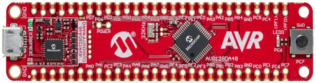

# CLI Example Using AVR DA Microcontroller and FreeRTOS with MCC Melody

This repository provides an FreeRTOS CLI example MPLAB® X project using MPLAB Code Configurator (MCC). The MCC Melody generated project offers a seamless integration of the FreeRTOS kernel files and port files, providing a basic project structure that can be used as starting point for an RTOS application.

## Related Documentation

More details and code examples on the AVR128DA48 can be found at the following links:

- [FreeRTOS™ pages](https://www.freertos.org/index.html)
- [FreeRTOS Demo for the Microchip AVR® Dx Port](https://www.freertos.org/microchip-avr-dx-demo.html)
- [AVR128DA48 Product Page](https://www.microchip.com/wwwproducts/en/AVR128DA48?utm_source=GitHub&utm_medium=TextLink&utm_campaign=MCU8_AVR-DA&utm_content=avr128da48-freertos-cli-mplab-mcc-github&utm_bu=MCU08)
- [AVR128DA48 Code Examples on GitHub](https://github.com/microchip-pic-avr-examples?q=AVR128DA48)

## Software Used
- [MPLAB X IDE 6.20 or newer](https://www.microchip.com/en-us/tools-resources/develop/mplab-x-ide?utm_source=GitHub&utm_medium=TextLink&utm_campaign=MCU8_AVR-DA&utm_content=avr128da48-freertos-cli-mplab-mcc-github&utm_bu=MCU08)
- [MPLAB XC8 2.46 or a newer compiler](https://www.microchip.com/en-us/tools-resources/develop/mplab-xc-compilers?utm_source=GitHub&utm_medium=TextLink&utm_campaign=MCU8_AVR-DA&utm_content=avr128da48-freertos-cli-mplab-mcc-github&utm_bu=MCU08)
- [MPLAB Code Configurator (MCC) 5.7.1 or newer](https://www.microchip.com/en-us/tools-resources/configure/mplab-code-configurator?utm_source=GitHub&utm_medium=TextLink&utm_campaign=MCU8_AVR-DA&utm_content=avr128da48-freertos-cli-mplab-mcc-github&utm_bu=MCU08)
- [AVR-Dx 2.6.303 or newer Device Pack](https://packs.download.microchip.com/#collapse-Microchip-AVR-Dx-DFP-pdsc)
- FreeRTOS Library - 2.0.1
- AVR Devices package 4.11.0 or newer

## Hardware Used

- The [AVR128DA48 Curiosity Nano Evaluation Kit](https://www.microchip.com/en-us/development-tool/DM164151) is used as a test platform:
 

## Operation

To program the Curiosity Nano board with this MPLAB X project, follow the steps provided in the [How to Program the Curiosity Nano Board](#how-to-program-the-curiosity-nano-board) chapter.  

## Setup

Before programming the board there are few steps to complete. The following configurations in FreeRTOS library and USART module are required:

-   Create a blank project and access the MCC. After the MCC is loaded, please add the FreeRTOS Library.
     

-   This example needs to have selected the TCB0 as Interface Timer, as in the picture below.
     

-   Click on RTOS_UART and change it to the next configuration.
     

-   In the Libraries Support section of freeRTOS we need to select this Port Selector and update it to the same configuration present in RTOS_UART.
     

-   Proceed by selecting the pins accordingly in the Pin Grid View.
     

-   Last step is to modify the Custom name for the pin PB3, as in the picture below.
     

## Demo

After programming the board, there are a few commands that are supported in this project. To get instructions about how to perform some actions it can be used the command help in the terminal, as in the picture below.
     

As it can be observed, those commands can provide information about the state of each FreeRTOS task, about the build info and so on.
     

## How to Program the Curiosity Nano Board

This chapter shows how to use the MPLAB X IDE to program an AVR® device with an `Example_Project.X`. This can be applied to any other projects.

- Connect the board to the PC

- Open the `Example_Project.X` project in MPLAB X IDE

- Set the `Example_Project.X` project as main project

  - Right click the project in the **Projects** tab and click **Set as Main Project**
     

- Clean and build the `Example_Project.X` project

  - Right click the `Example_Project.X` project and select **Clean and Build**
     

- Select **AVRxxxxx Curiosity Nano** in the Connected Hardware Tool section of the project settings:

  - Right click the project and click **Properties**
  - Click the arrow under the Connected Hardware Tool
  - Select the **AVRxxxxx Curiosity Nano** (click the **SN**), click **Apply** and then **OK**:
     

- Program the project to the board
  - Right click the project and then **Make and Program Device**
     

 

## Summary

This repository contains the FreeRTOS CLI example and it demonstrates the capabilities of the library using the AVR128DA48 Curiosity Board. 

## Menu

- [Back to Top](#cli-example-using-avr-da-microcontroller-and-freertos-with-mcc-melody)
- [Back to Related Documentation](#related-documentation)
- [Back to Software Used](#software-used)
- [Back to Operation](#operation)
- [Back to Hardware Used](#hardware-used)
- [Back to Setup](#setup)
- [Back to Demo](#demo)
- [Back to Summary](#summary)
- [Back to How to Program the Curiosity Nano Board](#how-to-program-the-curiosity-nano-board)